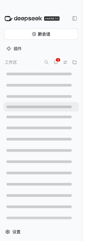

<sub>🌐 <b>中文</b> · <a href="README.en.md">English</a></sub>

<div align="center">

# dsh-hide-empty-workspace

> *「把最后一个会话归档的那一刻，那个空工作区自己从侧栏消失了。」*


[](LICENSE)


**侧栏的自动瘦身。它只在这条规则成立时动手：某个工作区的未归档会话从 `1+` 掉到 `0`。它不归档、不删除、不改写工作区注册，唯一会写的是浏览器里的隐藏集合。**

[它解决什么问题](#它解决什么问题) · [效果示例](#效果示例) · [快速开始](#快速开始) · [触发方式](#触发方式) · [安全边界](#安全边界) · [文件结构](#文件结构)

</div>

---

## 它解决什么问题

归档是 DSH 里一个**手动动作**，而「这个工作区已经空了」没有人替你判断。

于是侧栏总是这样烂掉：你随手给某个项目开过一两次会话，用过就归档掉，可那个工作区还留在列表里——没有会话，也不再有用，只是在那里占一行。攒到十几个之后，真正在用的那几个被挤到了下面。

这个插件把「空了」变成一个**被动触发的清理信号**：某工作区的未归档会话数从 `1+` 掉到 `0` 的那一刻，它的侧栏行自动隐藏。

**它只在那一刻动手。** 手动隐藏在任一工作区行自己的「…」菜单里；恢复入口在侧栏底部。插件不接管任何状态。

## 效果示例



上图是侧栏一列的截图，工作区名已隐去。连着隐藏两个工作区时只有一个变成 `display:none`——另一个是「正在使用的工作区」，按设计保持可见。

## 快速开始

```sh
# 从 npm 装（最短）
dsh plugin --profile web add dsh-hide-empty-workspace

# 或直接从 GitHub 装（不需要 npm 账号，也不等镜像同步）
dsh plugin --profile web add https://codeload.github.com/d0ublecl1ck/dsh-hide-empty-workspace/tar.gz/refs/heads/main

# 本地改代码时，把它以路径形式加进 profile
dsh plugin --profile web add /绝对路径/dsh-hide-empty-workspace
```

`dsh plugin add` 会在 profile 目录里同时写入 `dependencies` 与 `dsh.profile.bundles` 两处，装完刷新页面即可。

<details>
<summary>DSH Desktop 里没有 <code>dsh</code> 命令时</summary>

Desktop 自带一份运行时，直接用它可以跳过 PATH：

```sh
DSH_HOME="$HOME/Library/Application Support/dsh-desktop/harness" \
  "$DSH_HOME/.desktop-bin/node" \
  "/Applications/DSH Desktop.app/Contents/Resources/app.asar.unpacked/node_modules/@deepseek-ai/dsh/lib/bin.js" \
  plugin --profile web add /绝对路径/dsh-hide-empty-workspace
```

Windows 上把路径换成本机对应位置即可，参数不变。
</details>

## 触发方式

- **自动**：你把某个工作区的最后一个未归档会话归档掉 → 它的行隐藏。
- **手动**：悬停任意工作区行，点行内「…」菜单里的「隐藏工作区」。任何情况下都立即隐藏。
- **恢复**：点侧栏底部的「已隐藏 N」→ 打开官方对话框 → 逐个「恢复」，恢复完自动关闭。
- **自动恢复**：某个被隐藏的工作区重新有了未归档会话 → 自动取消隐藏。

不会触发的情况：

- **刚添加的工作区**：新工作区没有会话，但它是「首次见到」的，只被记录、不被隐藏。这是本插件不做「无会话即隐藏」的直接原因。
- **正在使用的工作区**：即使满足隐藏条件也保持可见（隐藏两个工作区时实测只有一个变成 `display:none`，另一个就是它）。
- **「未分组」桶**：永不隐藏。

## 安全边界

- **不归档、不取消归档、不删除**任何会话或工作区。
- **不改写工作区注册**：不动 `workspaces` 服务，不动 `settings.yaml`。
- **不联网**：插件不发任何请求。
- **唯一写入**是浏览器 `localStorage` 里的隐藏集合（键 `dsh-hide-empty-workspace.hidden.v1`）。清掉它，一切恢复原样。
- **不替换官方 UI**：只在官方已经渲染好的行上切 `display`，在工作区行自带的「…」菜单里追加一项，恢复入口用官方 `Modal`；不接管、不重绘官方组件。官方改版导致找不到行时，它不再默默无闻——侧栏底部会出现 `⚠ 工作区行标记失配，插件未生效`；但侧栏收成 rail（窄窗口自动收起）或切到「分组方式 → 单列表」时本就不渲染工作区行，自检保持安静。

## 文件结构

```text
index.js                    宿主半边（本插件不需要宿主能力，占位 apply）
client.js                   浏览器半边：判定、行菜单项注入、官方 Modal 恢复入口、自检
cordis.patch.yml            bundle 层，声明插入本插件
tests/hidden-workspaces.test.mjs   28 条纯函数单测
scripts/verify-browser.mjs  真实浏览器验收 + 展示产物录制
scripts/check-release.mjs   离线发布门
assets/showcase/            由 verify-browser 产出的截图与 GIF
screenshots.json            给插件市场/目录站的展示截图清单
AGENTS.md                   给下一次会话的边界与命令
.freak                      待核查线索：对标观察 + 未验证清单
```

